## Introduction
This is a minimal implementation of the CLIP model proposed by OpenAI, using PyTorch. For all the gory 
details: [Learning Transferable Visual Models From Natural Language 
Supervision](https://arxiv.org/pdf/2103.00020)  
Attention maps adapted for ViT by following: [Quantifying Attention Flow in Transformers](https://arxiv.org/pdf/2005.00928)  
_(todo:)SigLIP loss from: [Sigmoid Loss for Language Image Pre-Training](https://arxiv.org/pdf/2303.15343) 🚧_      

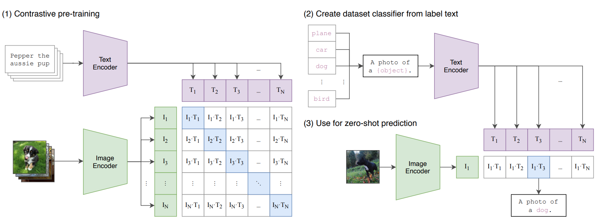   


The main idea behind CLIP is to map different modalities (e.g. images and their corresponding captions) into a common vector space. By doing so, the model learns to align _semantically_ similar pairs (e.g. an image and its _accurate_ description) while pushing away those that don’t match. This alignment is achieved by using a similarity matrix: the diagonal elements (representing matching pairs) are being forced via the loss function to have high similarity, while off-diagonal elements (representing non-matching pairs) are forced to have low similarity. (See animation below for a visual explanation.)   

<div align="center">
  
</div>
   
Practically speaking, CLIP leverages the information-rich features extracted from the transformers to capture the underlying semantics of each modality. In this implementation, I use a Vision Transformer (ViT) for processing images and a BERT-uncased model for handling text. Together with the similarity matrix, these transformer encoders allow the model to generalize across a diverse set of features. This method isn’t limited to images and text, it can be extended to other modalities, such as speech paired with text.  

This model can be trained as follows:
- **Projection Layer training only:** This requires to pre-extract image and text embeddings and then train 
small projection layers on these embeddings (Very fast training and ok results, only bottleneck is 
embedding extraction, not covered here).
- **Train everything:** This is our focus here in this project (i.e. backpropagate gradients to the transformers in a fine tuning fashion), this is slower - depends on 
your hardware, but yields best results.   

CLIP is capable of:
- **Zero-shot classification:** Predicting the category of an image without any task-specific training. ✅
- **Text-to-Image Retrieval:** Finding relevant images based on a text query. ✅
- **Image-to-Text Retrieval:** Searching for descriptive text based on an image. (🚧 todo: find test set descriptions)   


# Results

## Text-to-Image Retrieval
<div align="center">
  <figure>
    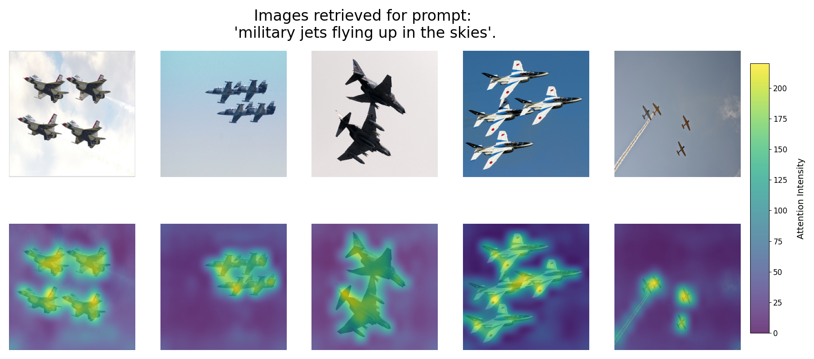
  </figure>

  <figure>
    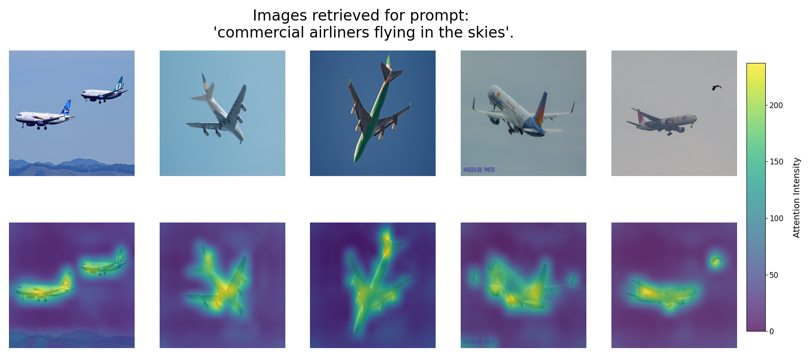
  </figure>
</div>

  <figure>
    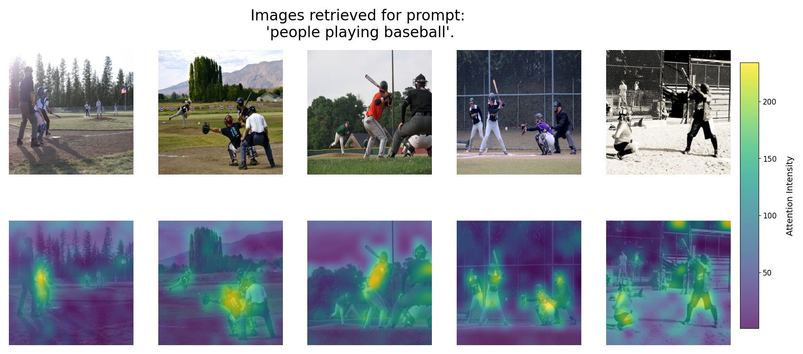
  </figure>
</div>

  <figure>
    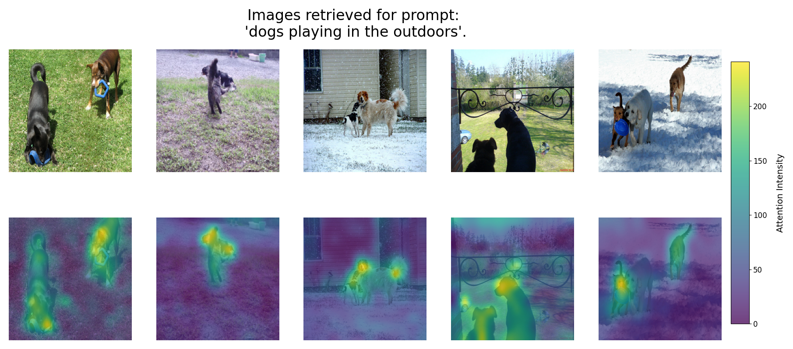
  </figure>
</div>

  <figure>
    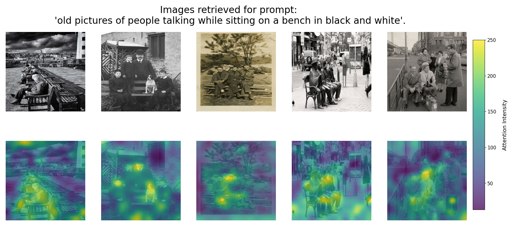
  </figure>
</div>

---

## Zero-shot classification
<div align="center">
  <figure>
    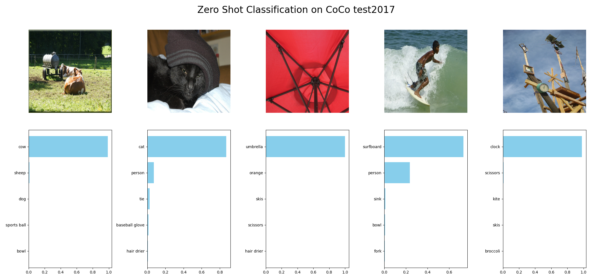
  </figure>

  <figure>
    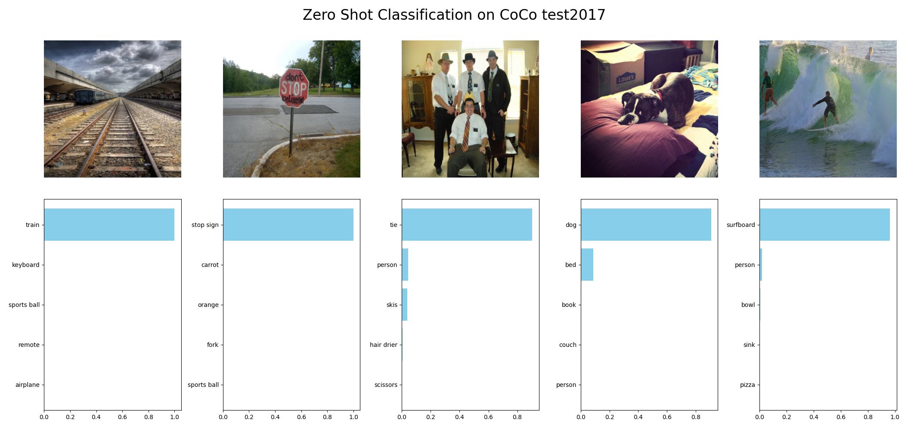
  </figure>
</div>

  <figure>
    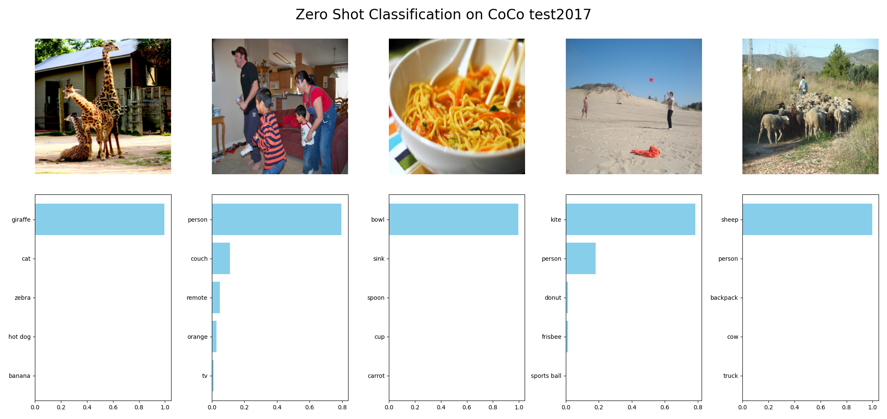
  </figure>
</div>

  <figure>
    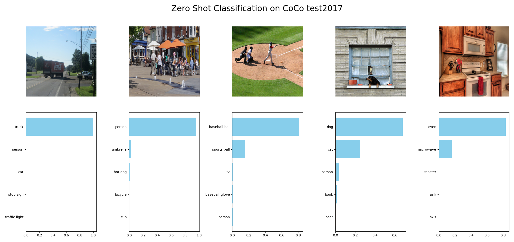
  </figure>
</div>

  <figure>
    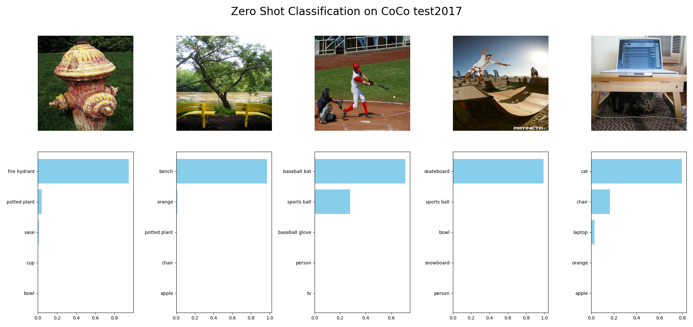
  </figure>
</div>

   
## General Requirements
- `Python >= 3.8`
- `Accelerate`
- `PyTorch`
- `Torchvision`
- `Transformers`
- `NumPy`
- `Matplotlib` 
- Other libraries: `tqdm`, `PIL`, `PyYAML`
- Dataset used: [`MS-COCO-17`](https://cocodataset.org/#download)
- CoCo labels used for Zero-Shot: [`coco-labels`](https://github.com/amikelive/coco-labels/tree/master)

full project requirements can be installed via pip:
```bash
pip install -r requirements.txt